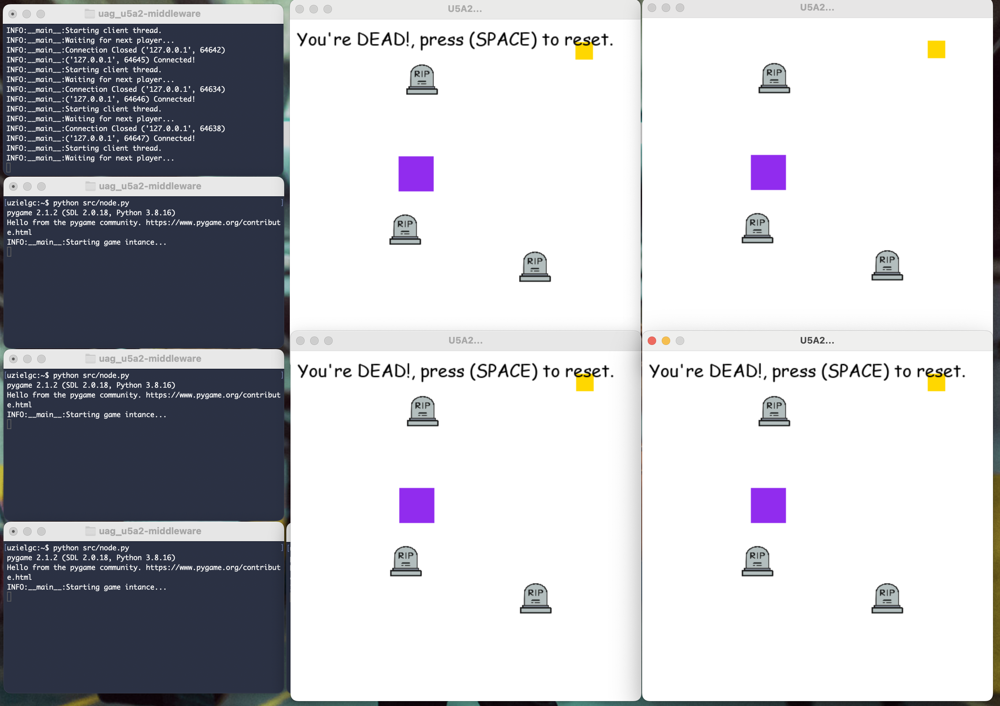

## U5 A2: Plataforma Middleware

### Author: Eloy Uziel García Cisneros (eloy.garcia@edu.uag.mx)
#### Repo: https://github.com/uzielgc/uag_u5a2-middleware

## Documentación

```
src/
  |-- game.py
  |-- network.py
  |-- node.py
  |__ server.py
```

Implementación de un server TCP corriendo en "localhost:20001". Crea un socker para aceptar conexiones,
cada conexión genera un nuevo thread para manejar cada cliente (jugador).
Cada cliente se mueve por un tablero hasta que se genera una moneda color dorado, quien atrape la moneda
se convierte en "cazador" y puede "comerse" a otros jugadores. Si el "cazador" te atrapa el cliente pierde el juego.
El juego es generado usando pygame y la comunicación entre nodos se serieliza utilizando pickle.

El código fuente se encuentra en la carpeta [src](src).

La evidencia en imagenes y/o video se encuentra en la carpeta [media](media).

El código esta comentado en los puntos clave del proceso.

### How to Run

Crear server:
```
python src/server.py
```

Inicializar cada uno de los clientes.
```
python src/node.py
```

*NOTA: instalar los requerimientos previo a ejecución:
```
pip install -r requirements.txt
```


[](media/game_.mov "Video Demo")

* Click en la imagen para ir al video demo. (media/game_.mov)^


### Output:

Terminal 1 server:
```
uzielgc:~$ python src/server.py 
pygame 2.1.2 (SDL 2.0.18, Python 3.8.16)
Hello from the pygame community. https://www.pygame.org/contribute.html
INFO:__main__:Starting coin thread
INFO:__main__:Waiting for next player...
INFO:__main__:('127.0.0.1', 64634) Connected!
INFO:__main__:Starting client thread.
INFO:__main__:Waiting for next player...
INFO:__main__:('127.0.0.1', 64638) Connected!
INFO:__main__:Starting client thread.
INFO:__main__:Waiting for next player...
INFO:__main__:('127.0.0.1', 64640) Connected!
INFO:__main__:Starting client thread.
INFO:__main__:Waiting for next player...
INFO:__main__:('127.0.0.1', 64642) Connected!
INFO:__main__:Starting client thread.
INFO:__main__:Waiting for next player...
INFO:__main__:Connection Closed ('127.0.0.1', 64642)
INFO:__main__:('127.0.0.1', 64645) Connected!
INFO:__main__:Starting client thread.
INFO:__main__:Waiting for next player...
INFO:__main__:Connection Closed ('127.0.0.1', 64634)
INFO:__main__:('127.0.0.1', 64646) Connected!
INFO:__main__:Starting client thread.
INFO:__main__:Waiting for next player...
INFO:__main__:Connection Closed ('127.0.0.1', 64638)
INFO:__main__:('127.0.0.1', 64647) Connected!
INFO:__main__:Starting client thread.
INFO:__main__:Waiting for next player...
INFO:__main__:Connection Closed ('127.0.0.1', 64647)
INFO:__main__:Connection Closed ('127.0.0.1', 64646)
INFO:__main__:Connection Closed ('127.0.0.1', 64645)
INFO:__main__:Connection Closed ('127.0.0.1', 64640)
```

Terminal - client:
```
uzielgc:~$ python src/node.py 
pygame 2.1.2 (SDL 2.0.18, Python 3.8.16)
Hello from the pygame community. https://www.pygame.org/contribute.html
INFO:__main__:Starting game intance...
```


